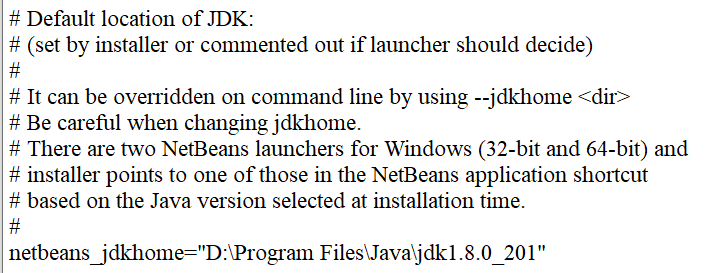
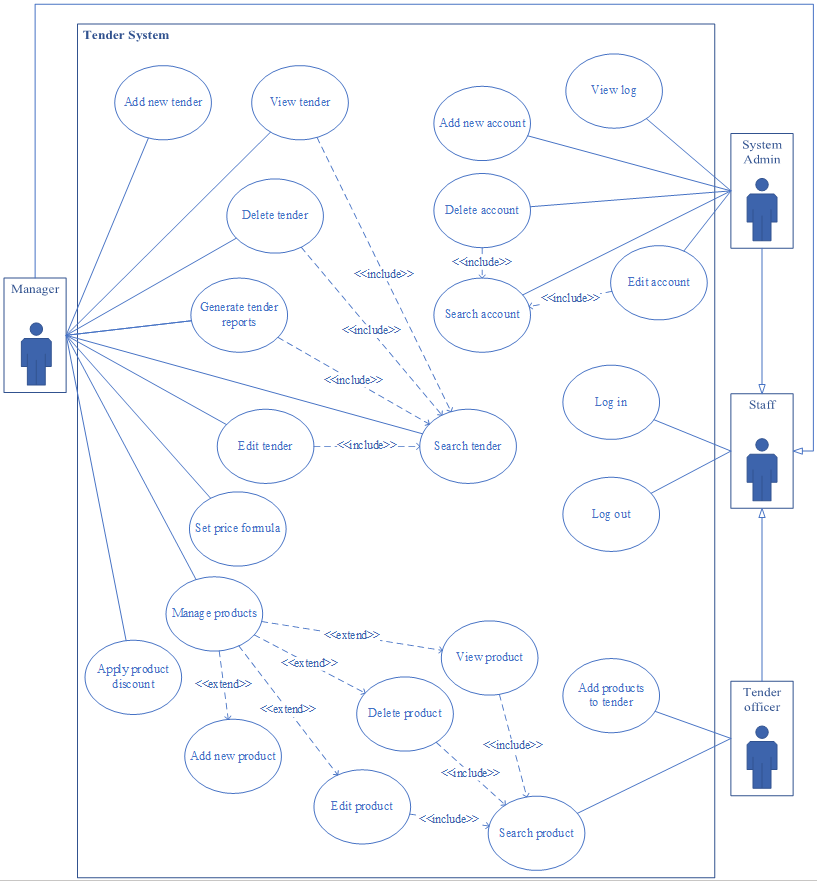
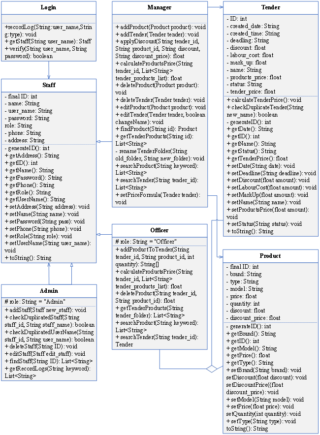
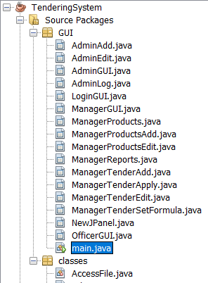
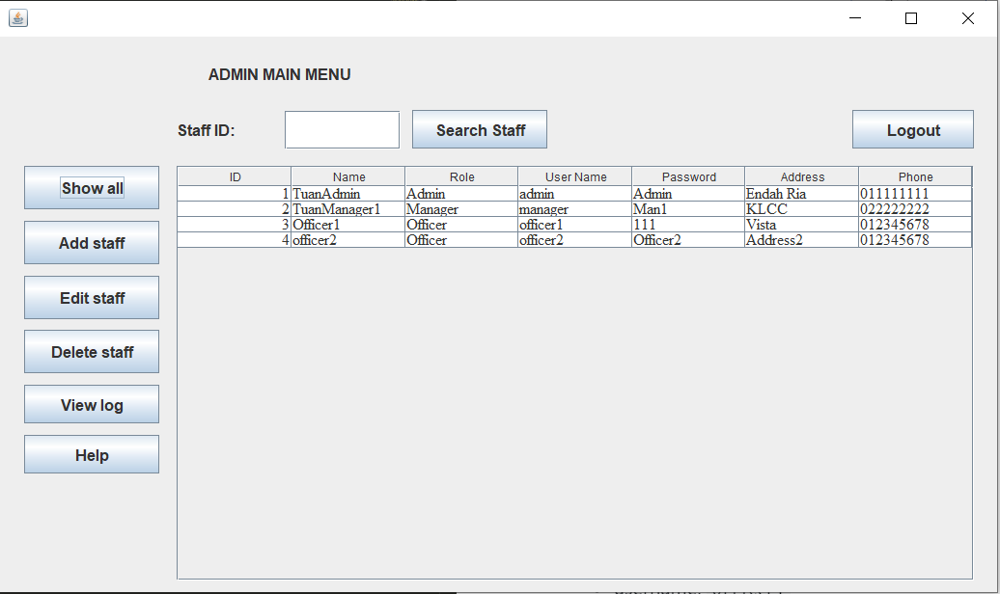
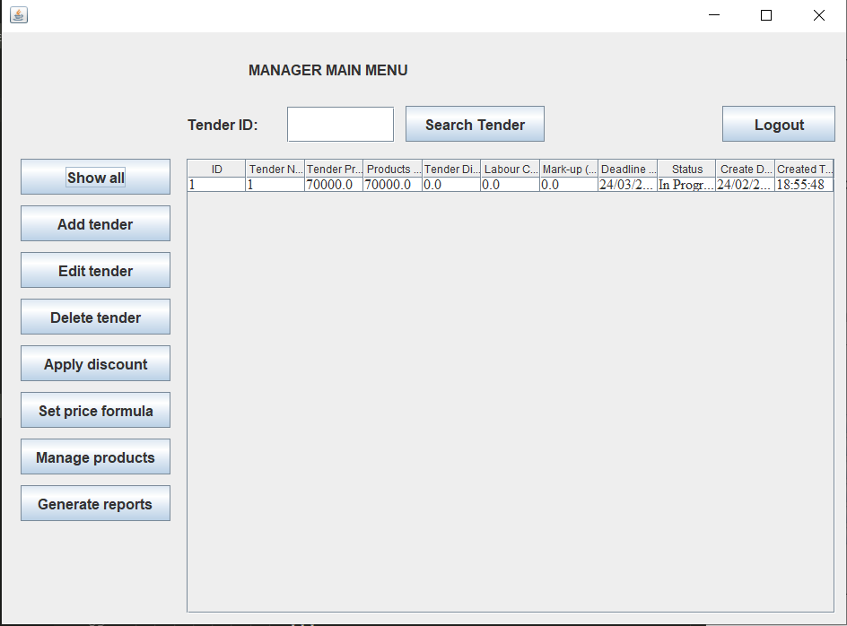
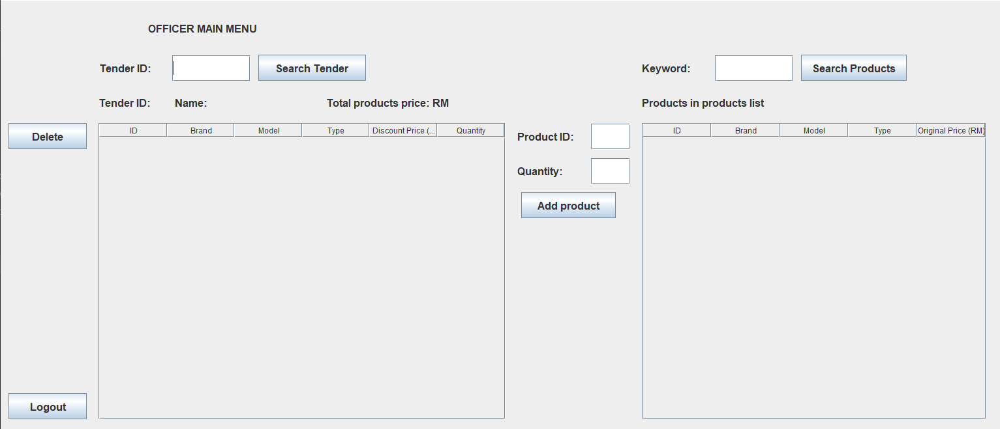

## Prerequisites
* JDK 1.8
* Netbeans 8.2

### Possible problem
If Netbeans 8.2 cannot open any file or project, set the correct path of jdk_home for Netbeans 8.2:
* Open `netbeans.conf` file in `etc` folder
* Find the line: `netbeans_jdkhome=` and enter the path of JDK 1.8
  

## Tendering system
This project is an oject-orient programming with Java project. The project is to implement a menu driven (GUI) system for a tendering company to manage tendering projects. Tendering system should be menu driven with options for:
* *System Admin*
  * Manage his/her profile
  * Manage Account for Manager (Add/Delete/Edit/View/Search)
  * Manage Account for Tendering officer (Add/Delete/Edit/View/Search) 
  
* *Manager*
  * Manage tendering requests (Add/Delete/Edit/View/Search)
  * Product Category and Material Specification (Add/Delete/Edit/View/Search)
  * Set and apply the discount to the selected products. (Add/Delete/Edit/View)
  * Set the formula to compute the tendering prices. (Add/Delete/Edit/View/Search)
  `Tendering price = Standard price (product) + discount + mark-up + labour cost`
  * Generate project tender reports with all related product listings.

* *Tendering officer*
  * Search for a particular product by general name.
  * Add product into the tender list
  * Compute the total prices

### Use case diagram & Class diagram
Use case diagram:

  

Class diagram:

  

## Tendering System GUI
### Run the tendering system
Please download and unzip the file `Tendering System.zip`. `Tendering System.zip` contains Java source. This project should be run in Netbeans 8.2

The file `main.java` under *GUI* package is run to start and use the tendering system.

  

### Users:
Tendering System can identify and show the correct GUI based on user's role. These users are created to test the system.
* System admin:
  * username: `admin`
  * passwd: `Admin`

* Manager:
  * username: `manager`
  * passwd: `Man1`

* Tendering Officer:
  * username: `officer1`
  * passwd: `111`

### Admin GUI
  
* Click `Show all` to show all users information
* Click `View log` to see login information
* Click `Help` to read briefing about funtions
* Click `Logout` to go back to Login GUI

### Manager GUI
  
* Click `Show all` to show all tendering projects
* Click `Generate reports` and enter `tender_id = 1` to see all products and total cost of a tender project
* Click `Set price formula` to adjust costs of the tendering project
* Click `Manage products` to add new products in the storage 
* Click `Logout` to go back to Login GUI

**Notice**:
* The manager must create a tender project `Add tender` so that tendering officer can see the tender project.
* The manager must manage and add new products using `Manage products` function so that tendering officer can add required products in the tender project.

### Tendering Officer GUI:
  

1. Officer enters tender ID `1` and click `Seach Tender` to show all required products in the tendering project.
2. To add more products in the tendering project:
  * On the right hand side, type product name: *phone*, *laptop* and click `Search Products`. All the available products are shown.
  * Enter *Product ID* and *Quality* then click `Add product`
  * Products will be added in the left hand side list.
  * *Total products price* is automatically calculated.
3. To delete products from the tendering project:
  * Choose the product from the left hand side list
  * Click *Delete* button to detele.

**Notice**:
* The tendering officer can only view tendering projects that are created by the manager.
* In products list on the right hand side, only manager can add and adjust the product information: price, 

## Data from text file
This tendering system creates and saves data as text file.
```
├── data
    └── logs.txt -- Save all logs information
    └── products list.txt -- Save available products in the storage. Added by the manager
    └── staff.txt -- Information of all users in tendering system. Modify by system admin
    └── order.txt 
    └── tender
        └── tender.txt -- Information of all tender projects: status, cost, date
        └── Project_name -- A new folder with project_name is created after manager adds a new project
            └── products.txt -- All products added by tendering officer
```
When the manage create a new tender project, in *tender* folder, a folder with project name is created with *products.txt*. Later, officer add products, this *products.txt* is updated with added products.
